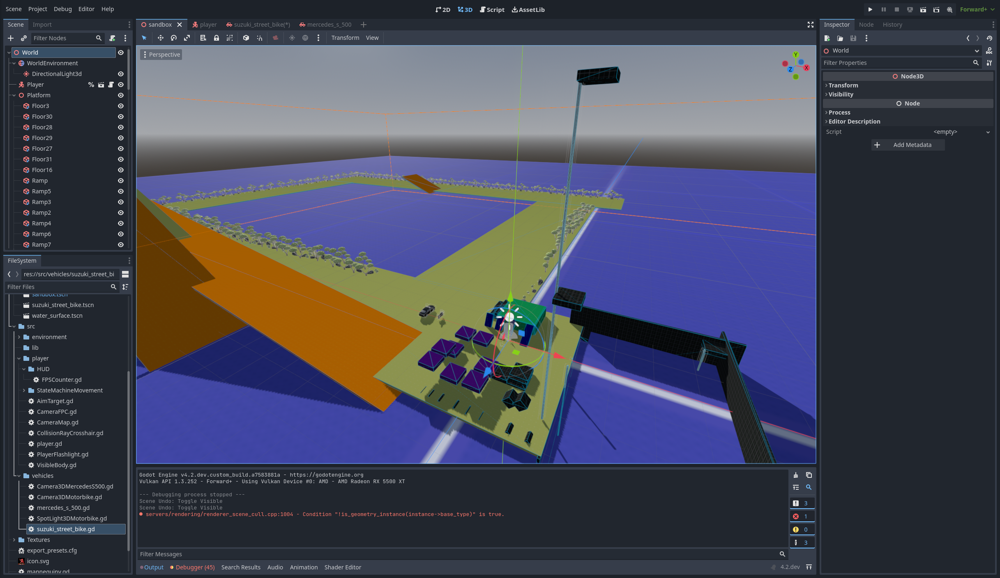
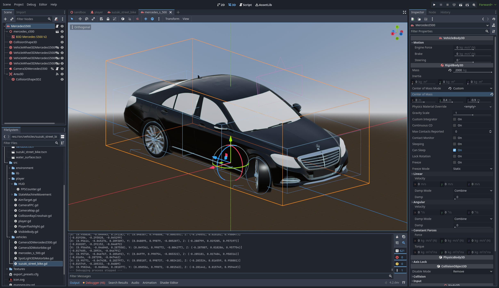
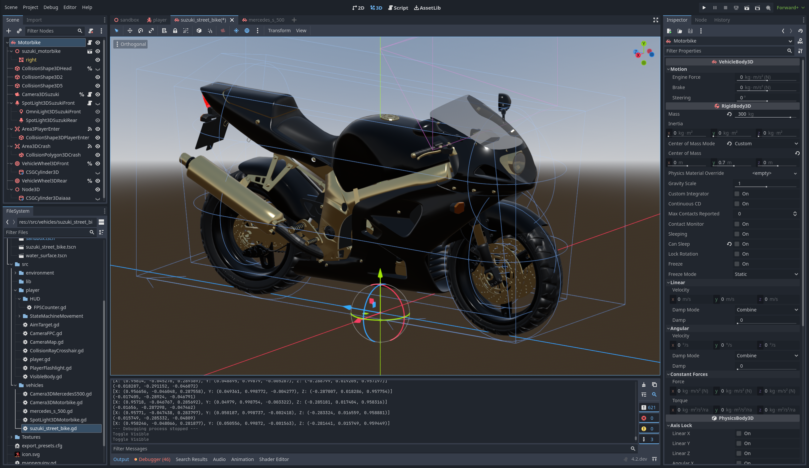

# Godot 4 - Advanced First Person and Vehicle (Car, Motorbike) Controller
This project contains the implementation of a First Person character controller for [Godot 4](https://godotengine.org/) for walking on <b>Land</b>, swimming in <b>Water</b> and moving <b>Ladders</b> up and down.

The code found in [player.gd](Player/player.gd) uses vector forces to move the player. You can tweak the values of the forces in the editor directly. The _velocity_ of the player is calculated as a result of the vector sum of different vector forces: walk, jump, gravity and drag.

This project contains [Blender](https://www.blender.org/) Models so in order to be able to run it, you need to have Blender installed and set up the path in your Godot [Editor-Settings](https://www.reddit.com/r/godot/comments/11iry2w/i_dont_see_many_or_any_people_talking_about_this/) -> FileSystem -> Import. After setting up this path, you will need to restart Godot.

The main scene is a _Sandbox_ scene used to test the controls:

## Controls Player (FPS-Controller)
| Keys | Action Name | Description |
|:------:|:-------------:|:-------------:|
| <kbd>W</kbd>,<kbd>A</kbd>,<kbd>S</kbd>,<kbd>D</kbd>, <kbd>left stick</kbd> | `move_` + _dir_ | Move |
| `mouse`, <kbd>right stick</kbd> | `look_` + _dir_ | Look/Aim |
| <kbd>Space</kbd>, <kbd>Xbox Ⓐ</kbd> | `jump` | On Land or Water Surface: Apply jump force;  In Water: Swim Up;  In Air: Press a second time to hold yourself in the air;  On a Ladder: Let go and fall down.|
| <kbd>Ctrl</kbd>, <kbd></kbd> | `crouch` | On Land: Crouch; In Water: Swim Down |
| <kbd>Shift</kbd>, <kbd></kbd> | `walk` | Slower Walking Speed |
| <kbd>Q</kbd>, <kbd></kbd> | `jump_high` | Apply alternative, higher jump force (stackable to fly up high). |
| <kbd>F</kbd>, <kbd></kbd> | `flashlight` | Toggle Flashlight |
| <kbd>M</kbd>, <kbd></kbd> | `map` | Show Player on Map (switch to alternative Camera hovering above Player). Use Mouse Wheel to Zoom in/out. |
| <kbd>ESC</kbd>, <kbd>Xbox Ⓑ</kbd> | `exit` | Close the game |

You can change any of this keys in: Project Settings → Input Map.

## Controls Vehicles
[Source of the Car-Modell](https://www.b3dassets.com/2021/05/29/cars-3d-model-library/)

[Source of the Motorbike-Modell](https://www.b3dassets.com/2022/09/03/blender-motorcycle-3d-model-library/)

You need to stand close to the Motorbike in order to enter it. To enter the car, you need to stand directly at one of the front doors.
| Keys           | Action Name                                | Description              |
|:--------------:|:------------------------------------------:|:------------------------:|
| <kbd>E</kbd>   | `use`                                      | Enter/Exit Vehicle       |
| <kbd>W,S</kbd> | `vehicle_accelerate`; `vehicle_decelerate` | Forward; Break; Backward |
| <kbd>A,D</kbd> | `vehicle_left`; `vehicle_right`            | Left; Right              |

